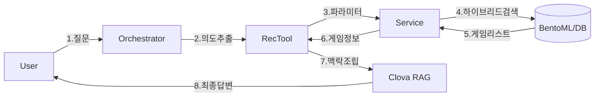

# RAG Reasoning Architecture Walkthrough

사용자가 "퇴근 후 힐링할 만한 10000원 이하의 게임 추천해줘"라고 질문했을 때, 시스템 내부에서 어떤 일이 일어나는지 단계별로 상세히 설명합니다.

---

## 🏗️ 전체 아키텍처 흐름도



---

## Step 1: 의도 파악 (Intent Router & Orchestrator)
**파일**: `backend/app/domains/chat/orchestrator.py`

사용자의 자연어 질문을 분석하여 **"무엇을 원하는지(Mode)"**를 판단하고, 필요한 데이터를 **추출(Extraction)**합니다.
**핵심 변경점**: 단순 분류기였던 Orchestrator의 **System Prompt를 대폭 수정**하여, RAG에 필요한 "맥락(Context)"을 지능적으로 뽑아내도록 강화했습니다.

### 1-1. Smart Routing (지능형 분류)
단순 키워드 매칭이 아니라, **사용자의 근본적인 목적**을 파악합니다.

*   **Recommendation (추천)**: "발견(Discovery)"이 목적일 때
    *   User: "10000원 이하의 게임 **찾아줘**" (단어는 검색이지만, 목적은 추천)
    *   Router: "조건(1만원)에 맞는 게임을 찾고 싶어하므로 **추천 모드**로 진입합니다."
*   **Search (검색)**: "사실 확인(Fact-checking)"이 목적일 때
    *   User: "엘든링 출시일이 언제야?"
    *   Router: "특정 지식을 묻고 있으므로 **검색 모드**로 진입합니다."

### 1-2. Smart Extraction (데이터 추출)
추천 모드로 결정되면, 자연어에서 핵심 파라미터를 JSON으로 추출합니다.

*   **Input**: "퇴근 후 힐링할 만한 10000원 이하의 게임 추천해줘"
*   **System Output (`IntentAnalysis`)**:
    ```python
    {
        "intent": "RECOMMENDATION",
        "user_mood": "퇴근 후 지친 상태, 힐링 필요",  # [Context] RAG에서 사용
        "max_price": 10000,                       # [Constraint] 정수 변환됨
        "search_keywords": ["Healing", "Peaceful"] # [Tag] Steam 태그 매핑 유도
    }
    ```
*   **Action**: 추출된 정보를 가지고 `PersonalizedRecommendationTool`을 호출합니다.
    *   이때 **"반드시 한국어로 답변하세요"**라는 프롬프트가 Agent에게 주입됩니다.

---

## Step 2: 도구 실행 및 파라미터 전달 (Tool Entry)
**파일**: `backend/app/domains/chat/tools/tool_recommand.py`

추출된 파라미터를 받아 **비즈니스 로직(Service)**으로 전달할 준비를 합니다.

*   **Function Call**:
    ```python
    await tool.execute(
        steam_id="76561198...",
        top_k=5,
        search_keywords=["Healing", "Peaceful"],
        constraints={"max_price": 10000}
    )
    ```

---

## Step 3: 하이브리드 검색 (Service Layer)
**파일**: `backend/app/domains/recommendation/integrated_service.py`

사용자의 **취향(History)**과 **요구사항(Tag/Constraint)**을 모두 만족하는 게임을 찾습니다.

*   **Logic (Hybrid Recommendation)**:
    1.  **Vector Search**: `search_keywords`("Healing", "Peaceful")와 의미적으로 가까운 게임 100개를 찾습니다.
    2.  **Filtering**: `max_price` (10000원) 이하인 게임만 남깁니다.
    3.  **Re-ranking**: 남은 게임 중, 사용자의 플레이 이력(Tycoon 선호 등)과 유사도가 높은 순으로 정렬합니다.
*   **Output**: `['Stardew Valley', 'Coral Island', ...]`

---

## Step 4: RAG_reasoning(추천 이유) 생성 컨텍스트 조립 (Tool Logic)
**파일**: `backend/app/domains/chat/tools/tool_recommand.py`

이제 검색된 게임을 "왜" 추천하는지 설명하기 위해, **RAG 모델에게 줄 힌트(Context)**를 조립합니다.

*   **Context Injection (한국어 라벨링)**:
    Service 단계에서는 데이터(`search_keywords`)만 썼지만, 설명 단계에서는 이것이 **"어떤 의미인지"** 텍스트로 풀어줍니다.
    ```python
    agent_context = """
    - 사용자 검색 의도(키워드): Healing, Peaceful
    - 필수 제약 조건: max_price=10000
    """
    ```
    이 텍스트가 `rag_provider`에게 전달됩니다.

---

## Step 5: 최종 RAG_reasoning(추천 이유) 생성 (RAG Provider)
**파일**: `backend/app/domains/chat/providers/rag_reasoning.py`

Clova Studio(HCX-007)에게 최종 프롬프트를 전송하여 답변을 생성합니다.

*   **Dynamic Prompt Construction**:
    ```text
    [System]
    당신은 스팀 게임 추천 전문가입니다.
    Agent가 제공한 사용자의 현재 상황(힐링), 요구사항(1만원 이하)을 중점적으로 분석하여 설명하세요.

    [Game Info]
    Name: Stardew Valley
    Tags: Farming, RPG, Pixel Art
    Description: 할아버지의 오래된 농장을 물려받아 새로운 삶을 시작하세요... (~150자)

    [Agent Context]
    - 사용자 검색 의도: Healing, Peaceful
    - 필수 제약 조건: max_price=10000
    ```
*   **LLM Generation**:
    > "Stardew Valley를 추천합니다. (1) 평소 좋아하시는 시뮬레이션 장르이면서, (2) 요청하신 '힐링' 테마에 완벽하게 부합하는 평화로운 게임입니다. (3) 가격 또한 16,000원으로 예산 범위에 적합하며 플레이 타임 대비 만족도가 매우 높습니다."

---

## ✅ 요약
1.  **Orchestrator**: 찰떡같이 알아듣고 데이터로 **추출**.
2.  **Service**: 데이터로 게임을 **검색**.
3.  **Tool**: 검색 의도를 설명용 텍스트로 **변환**.
4.  **Provider**: 변환된 텍스트를 보고 그럴싸한 이유를 **작성**.
