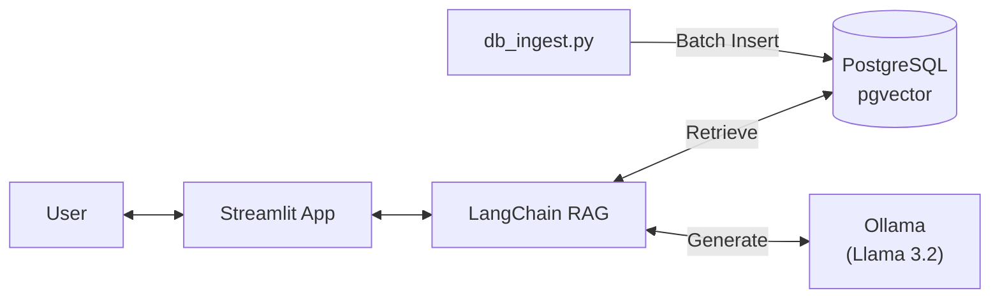

# 🎮 Steam Game Recommendation Chatbot (Prototype)

**Llama 3.2 3B**와 **PostgreSQL (PGVector)**를 활용한 로컬 기반 Steam 게임 추천 RAG(Retrieval-Augmented Generation) 챗봇 프로토타입입니다.

## ✨ 주요 기능
*   **Local LLM**: Ollama를 통해 Llama 3.2 3B 모델을 로컬에서 구동 (API 비용 0원)
*   **Vector DB**: PostgreSQL + pgvector를 사용하여 게임 데이터를 효율적으로 검색
*   **Interactive UI**: Streamlit 기반의 채팅 인터페이스 제공
*   **Hot-Reloading**: 소스 코드(`src`, `ui` 등) 수정 시 실시간 반영 (Watch Mode)
*   **Data Pipeline**: Parquet 기반의 대용량 데이터 배치 처리 및 고속 주입 (Ingestion)

## 🏗️ 아키텍처


## ⚠️ 한계점 (Limitations)
현재 프로토타입 버전은 다음과 같은 구조적 한계가 있습니다:
1.  **Single-turn Generation**: 이전 대화 맥락(History)을 기억하여 답변하지 않으며, 매 질문을 독립적으로 처리합니다.
2.  **No Query Routing**: 사용자의 질문 의도(단순 대화 vs 검색 필요)를 파악하는 라우팅 로직이 없어, 모든 질문에 대해 DB 검색(Retrieval)을 수행합니다.

## 🚀 실행 방법

### 1. 전제 조건
*   **Docker Desktop** (또는 Docker Engine + Compose)
*   **NVIDIA Driver** (Ollama GPU 가속 시 권장, CPU 모드도 가능)

### 2. 프로젝트 실행
루트 디렉토리(`ml_llm`)에 있는 `execute.sh` 스크립트를 사용하여 간편하게 실행할 수 있습니다.

```bash
# 실행 (빌드 포함)
./execute.sh

# 백그라운드 실행
./execute.sh -d

# 🍎 Mac (Apple Silicon) 최적화 실행
./execute.sh --mac
# - Docker 내부 Ollama를 끄고, Host의 Ollama(Metal GPU 가속)를 사용합니다.
# - 사전 조건: Mac 터미널에서 `ollama serve`가 실행 중이어야 함.
```
*   최초 실행 시 `llama3.2:3b` 모델 다운로드(약 2GB)로 인해 시간이 소요될 수 있습니다.
*   `execute.sh`는 `rag-ollama` 서비스의 로그를 화면에 출력하지 않습니다. (백그라운드 기록)

### 3. 접속
*   **Web UI**: [http://localhost:8501](http://localhost:8501)
*   **Ollama API**: [http://localhost:11434](http://localhost:11434)

## 📂 디렉토리 구조
```text
ml_llm/ (Root)
├── execute.sh          # 실행 스크립트 (Mac/Linux 통합)
├── pyproject.toml      # 의존성 관리
├── uv.lock             # 의존성 잠금 파일
├── .dockerignore       # Docker 빌드 제외 설정
├── raw_to_doc.py       # (전처리) Parquet -> JSONL 변환
├── doc_to_vector_local.py # (임베딩) 로컬 벡터 생성
├── run_*.sh            # 전처리/임베딩 실행 쉘 스크립트
└── proto/repl/         # 챗봇 프로토타입 디렉토리
    ├── app.py              # Streamlit 엔트리포인트
    ├── docker-compose.yml  # 서비스 오케스트레이션
    ├── Dockerfile          # App/Ingestion 이미지 정의
    ├── core/               # RAG 로직 (Recommender, Chain)
    ├── ui/                 # UI 컴포넌트 (Sidebar, Chat)
    ├── scripts/            # DB Ingestion 유틸리티
    ├── data/               # 임베딩 데이터 (Parquet)
    ├── models/             # HuggingFace 모델 캐시
    ├── logs/               # 실행 로그
    └── .gitignore          # Git 설정
```

## 🛠️ 개발 가이드
*   **코드 수정**: `app.py`, `ui/`, `core/` 폴더 내의 파일을 수정하고 저장하면, 브라우저에서 즉시 변경 사항을 확인할 수 있습니다.
*   **로그 확인**:
    *   App/DB/Ingestion: 실행 중인 터미널 확인
    *   Ollama: `docker logs -f rag-ollama`
*   **데이터 주입 재실행**:
    ```bash
    docker compose -f proto/repl/docker-compose.yml up ingestion
    ```
